# Toxic Release Inventory(TRI) ELT/Analysis:

## A fully functional project written in Python that creates a TRI  Database Model and a Data Extraction Pipeline to insert clean data into the TRI database for further Analysis.

### This goal of this project is answer questions such as:

#### Basic Profiling:
1. What facility was involved in dumping the most pounds of waste throughout the years (Ranks 1 to Rank 5)?
    1. **1998-2024 (Cominco Alasaka Inc, Well known as Red Dog Mine)**:
        * According to our graph. From 1998 - 2014 we see an upward trend of total releases and 2014 - 2024 we see an up and down spikes. So whats happening here? 

        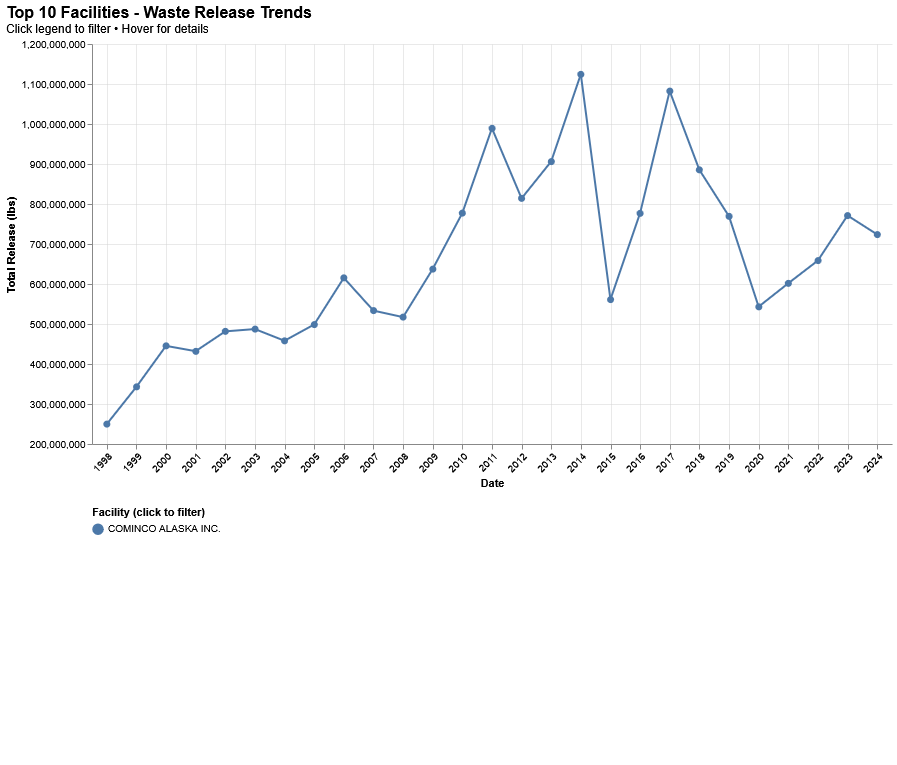

            Red Dog Mine is the world largest producers of Zinc and Lead. They are the largest US toxic polluters, which is also backed according to my database, as Cominco Alsaka INC. is ranked 1, by the most total toxic waste released by facility. They are also the reason why Alaska (37.1 million lbs) and the Artic(481.6 million lbs) are the top 2 most released toxic release per pound locations. According to EPA, Alaska ranked first in the nation for the largest total releases of chemicals in 2002, with 545.5 million pounds of toxics coming from the mining industry. The hard rock mining industry is the nation's largest toxic polluters relesed 1.3 billion lbs or 27% of toxics released by U.S. industry. According to Pam Miller, hardrock industry release toxins such as lead, copper, zinc heavy metals etc that pollute land, water, and air. According to our map, Zinc and Lead are the most released toxins in Alsaka. 
        
    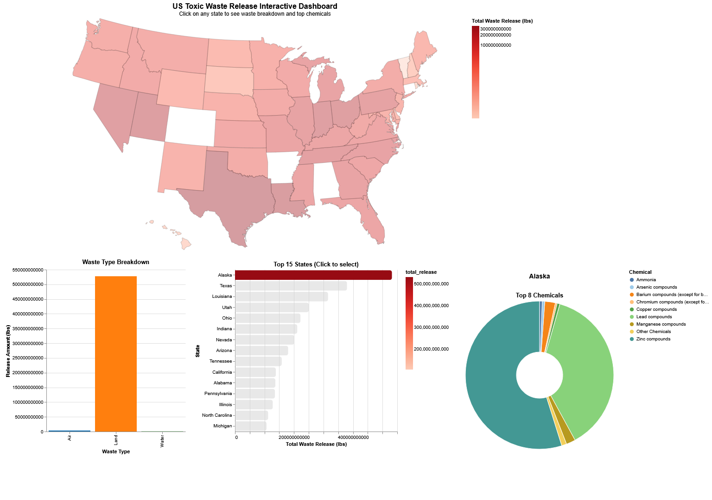
        
        https://www.akaction.org/publications/red-dog-and-subsistence-analysis-of-reports-on-elevated-levels-of-heavy-metals-in-plants-used-for-subsistence-near-red-dog-mine-alaska/
        
    2. **Kree Mcgee Corp(1998-2012)**

        * After analysis the total_waste_throughout_top_10.html chart. We see a massive gap between **Kree Mcgee Corp** and other facilities during the 1987 approximately 5.2 billons of pounds worth of waste gap. While I can't seem to find the articles for the specific year, I did find articles about Kerr Mcgee prior to 1987. 
        
            According to the DARRP(Damage Assement Remedition, and Restoration Program) between 1979-1980 Kerr Mcgee dismantled one of its creosote wood-treating facilities located at "250-acre parcel of land adjacent to the Cape Fear River, Brunswick River and Sturgeon Creek in Navassa, North Carolina."(DARRP), which then released Creosote and sludge, which then led to the release of SVOC (Semi Volatile Organic Compound) spefcically the PAH(Polycyclic Aromatic Hydrocarbon) which is released to soils, groundwater, and surronding marsh sediments sites. According to my database (which I got the data from EPA.gov) PAH is a Cancer Causing PBT chemical.
            
            https://darrp.noaa.gov/hazardous-waste/kerr-mcgee-chemical-corp-tronox

            
            According to the NRC(Nuclear Regulatory Commission) Kerr Mcgee dropped '...fabricate enriched uranium and mixed oxide fuels for nuclear reactors from 1965–1975.'(NRC) between 1965-1975 at Cimarron site located at Cimarron City, Oklahoma. Where '... On site, there were several buildings, collection ponds, sanitary lagoons, storage areas, and burial areas.'(NRC).
            
            https://www.nrc.gov/info-finder/decommissioning/complex/kerr-mcgee-cimarron-corporation-former-fuel-fabrication-facility
            
            According to the EPA(Enviromental Protection Agency) between 1940s-1980s Kerr Mcgee mined over 7 million tons of uranium at northeastern Arizon, Navajo Nation, Chapter Cove which consists of 50 AUMs(Abandoned Uranium Mines). Which affected the air and water, future land use, health, and workforce development of the community living near Lukachukai, and Carrizo Mountains on the Navajo Nation. Through 2000s - 2020 action have been taken by many entites such as EPA, AML(Abandoned Mine Lands) programs, and ASPECT(irborne Spectral Photometric Environmental Collection Technology) to recover the Cove from damages. 
            
            https://www.epa.gov/navajo-nation-uranium-cleanup/cove-area-mines
            
        The Activites of Kerr Mcgee stops at 2001 according to my analysis, due to all the legal pushback and brought by Anadrako Petroleum at 2006. 
        
    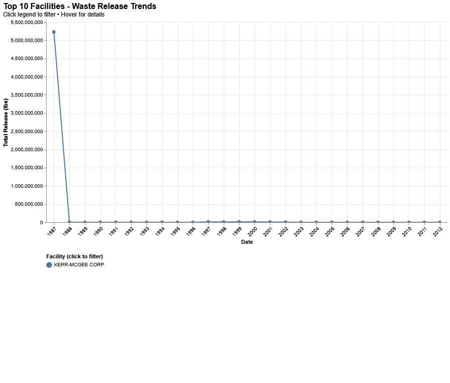
    
        https://www.sec.gov/Archives/edgar/data/773910/000095012906007908/h38749exv99w1.htm

    3. **Rio Tinto(1997-2024)**:
            There was a Huge spike in waste drop in 1999 then it slowly went down until 2002, then it started slow spikes up and down until 2024. Most notable thing I found during the 1990s was the war between Panguna Mine and its people at Bougainville, Papua New Guinea

            Panguna Mine, Bougainville, Papua New Guinea
                Disposed billions tons of toxic waste on land and water, filling the rivers with tailing. Also polluted major bays dozen of miles away, and Pacific Ocean as well(London Mining Network) that caused death and illness (Asthma TB, upper respiratory infection). The war casued deaths of 10,000 people in between 1990 - 1997.
                Billions tonnes of mine waste were released into the Jaba and Kawerong rivers between 1972 and 1989 due to operations of Panguna Mine(Human Rights Law Centre). 
            Grasberg Mine, West Papua, Indonesia:
                Joint Venture between Rio Tinto(40%) and Freeport McMoRan. They dumped 1 billion tons of tailing into indonesian, West papua local streams and over the life of the project they dumped 3.5 billion metric tons of waste even under the Indonesia’s water quality control regulation. between 
            Kelian Gold Mine, Indonesia:
                closed in 2005 and in its 13 years of production dumped 100 million metric tons of waste rock into the environment most of which were contaminated and in 1996 almost 1,100 kilogrammes of cynide was released in the Kelian Rivers. They kille, evicted, and polluted clean waters of the villagers. These polluted water caused rashes and eye infections.  
            Flambeau Mine, Ladysmith, Wisconsin, USA:
                between 1993 and 1997, they produced 181,000 tons of copper, as well as gold and silver. in 2009 a lawsuit occured that exposed surface and groundwater pollution from partially reclamied mines causing copper contamination in crayfish.
            QMM Mine, Fort-Dauphin, Madagascar:
                began construction at 2006 and contain at least 75 million tons of limenite(Titanium oxide) deposits, found in mineral sands
            
            Rössing Uranium Mine, Namibia:
                Rio Tinto owns about 69% of the mine, which produced more than 9 million pounds of uranium in 2009(59) and is expected to remain in operation until at least 2023.
                The mine produces 20 million tons of crushed, sulphuric-acid-soaked, slightly radioactive rock on an annual basis.  In addition, the plant consumes millions of cubic metres of fresh water annually in a region where rainfall totals only about 3 centimetres per year.(68)

    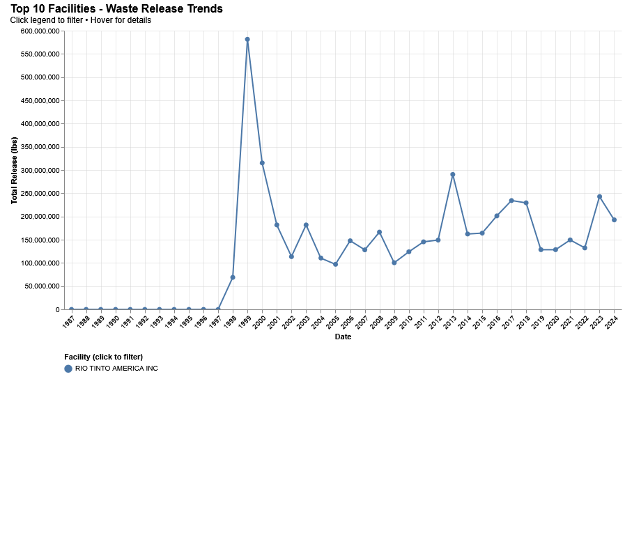

        https://londonminingnetwork.org/2010/04/rio-tinto-a-shameful-history-of-human-and-labour-rights-abuses-and-environmental-degradation-around-the-globe/
        https://www.hrlc.org.au/reports/2024-12-6-panguna-mine-impacts/ 
    
    4. **Barrick Gold(1998-2024)**
            According to corpwatch, Barrick Gold Leaches gold from the ore required 6613 of cynide per year at Lake Cowal. At 1992 a train crash at Condobolin Austrilia spread 40 metric tons ofr cyanide pelets on accross ground. In 1990 Barrick gold began their gold mining operation at Porgerans. dumping poison waste into Porgera local streams that includes cynide and other toxins, they would dump 6.6 tons per ounce of gold produced in the 2000 and by 2006 approximately 97.6 ton dropped. 
            
            Barrick golds Pascua Lama and Veladero mining facilities at in  '...semi-desert region of the Andean Cordillera, on the Chilean-Argentinean border.'(corpswatch). They still used cyanide during the 1990s (stopped in 2000 due Declaration of Berlin), and Mineral Extraction process caused dust emission containing '...particles of lead, arsenic, ura-nium, chromium, zinc, asbestos, mercury, sulphur, cobalt, man-ganese, etc.'(corpswatch), which polluted the soil and ground water, melted 10.2 arces of glaciers, and caused a drought on Estrecho and Toro Rivers by taking 42 liters of waters/sec to run mining operation. 
            
            1975-1991 200 million tons of mine tailings went directly into Calancan Bay waters causing the Philipines government to call State calamity for health reasons due to lead contamination.In 1996 '..Marcopper Mine filled the 26-kilometer-long Boac River onMarinduque with 3-4 million tons of metal-enriched and acid-generating tailings'(corpswatch)
                  
            According to Greg Jones and Glenn Miller. Amount of mercury released into the atomospehere from gold mines has not been systematically measured and reported, and reliable estimates were not available, they were esitmate based on the EPA's series of emisson factor requirements.
        
            According to Miller and Jones Neveda Gold Mines released 3700 lbs of mercury air emission in 1998, Barrick released 13,629 tons of Mercury by-product in 1999. 
            
            We can speculate that Majority of the pollution at the State of Utah and Neveda came from these Gold Mines([By State 2003 - 2025](#visualization)). Accoriding to my State Waste map 2003 - 2025 and 2020s most of the pollution occured in Lands with metal related chemicals such as mercury or mercury related compounds. 
        
    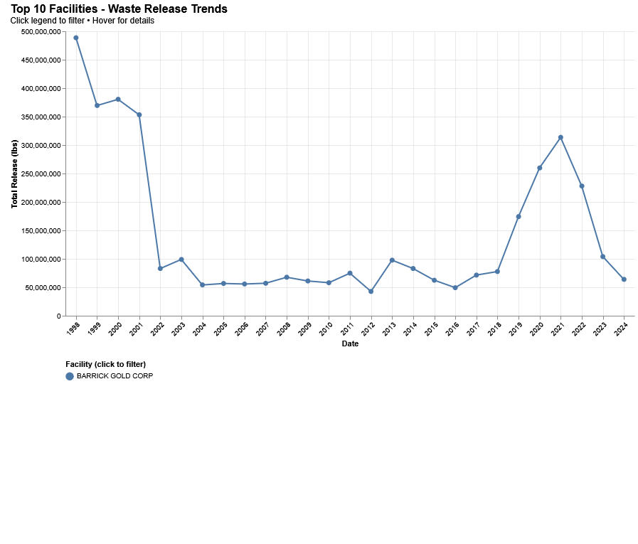

        https://downloads.regulations.gov/EPA-HQ-SFUND-2015-0781-2119/content.pdf
        https://www.nps.gov/subjects/air/humanhealth-sulfur.htm
        https://www.recastingthesmelter.com/?p=3927
        https://www.epa.gov/enforcement/case-summary-asarco-2009-bankruptcy-settlement
        https://www.corpwatch.org/sites/default/files/Barrick%27s%20Dirty%20Secrets.pdf
    
    5. **Freeport McMoRan**
        
        There was a huge spike between 1997-2000. 
        According to Earthworks, Freeport sends more than 76 million metric tons of tailings and waste rock into Indonesian rivers every year. The company puts the 2017 figure at 50 million tons. Without spelling out precisely how the requirement should be met, Indonesia told Freeport that it would boost to 95 percent from half the amount of tailings that must be recovered from the river system, according to Adkerson. 

        Billions of gallons of sludge escaped to travel hundreds of kilometers down the Doce river, killing at least 19 people and leaving hundreds homeless.

        Freeport Mine dumps around 10, 000 tons of toxic waste per day in previous years, now it
        has reached 300,000 tons per day. The tailings are channelled through the Ajkwa river, which
        is located east of the city of Timika

    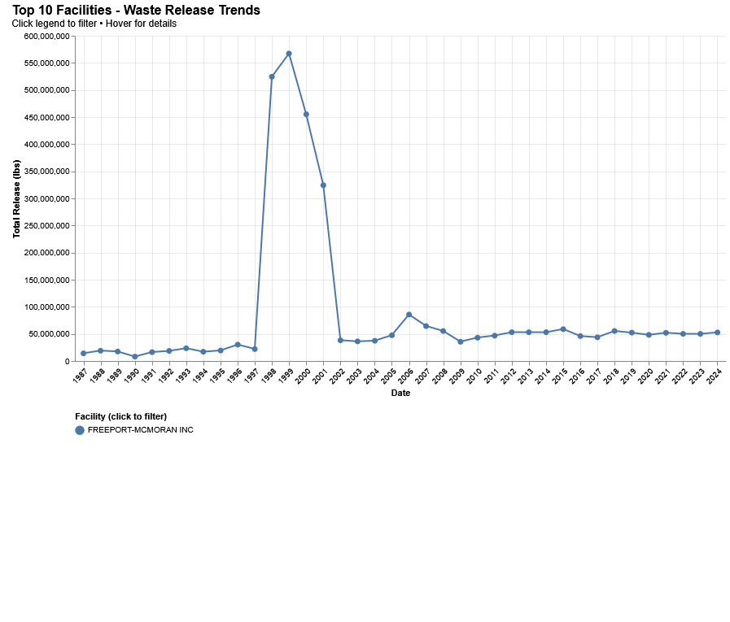    

        https://www.ohchr.org/sites/default/files/2022-06/Solidarity%20for%20Indigenous%20Papuans1.pdf
        https://www.mining.com/web/giant-mine-spewing-waste-decades-turns-battleground/

2. What State has the most pounds of waste throughout the years (Ranks 1 to Rank 5)?
    1. Alaska:
        Has approximately 532 billion lbs of waste, containing majority of chemicals such as 291 billion lbs of Zinc and 200 billion lbs of lead. Majortiy of the waste are land based where 527 billion lbs of land waste. From our facility Analysis we determined that Cominco Alasaka Inc were mostly involved in polluting the lands. 

    

    2. Texas:
        Has Approximately 387 billion lbs of waste, containing majority of chemicals such as 69 billion of ammonia and 27 billion of Nitrate and Aluminum. Majority of waste is land based 201 billion lbs, but also has 100 billion lbs of Air waste. Since Texas has a lax regulatory enviroment laws where its easy for polluting facilities to dump waste as long as they have permits. 
    
    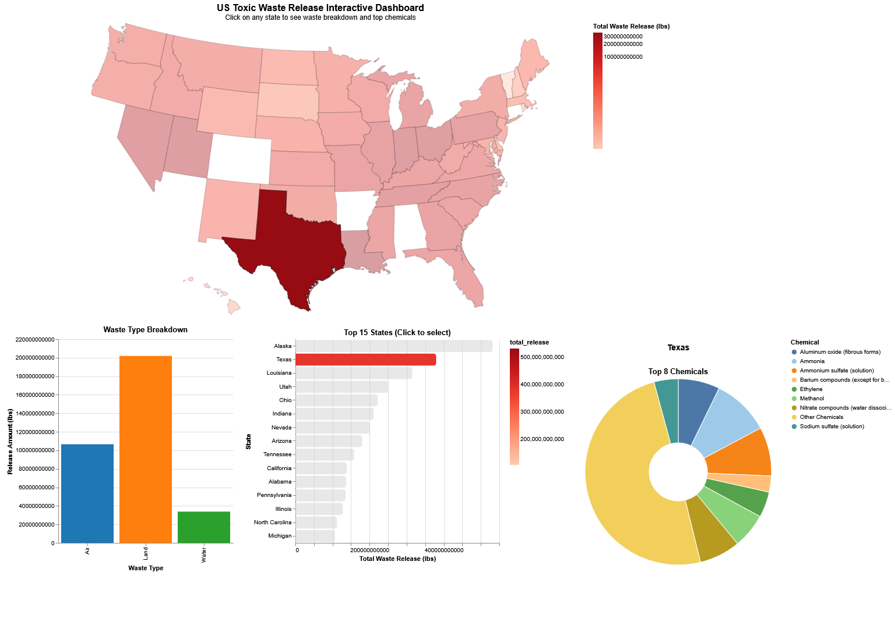
    
    3. Louisanna:
        Is right next to Texas has approximately 315 billion lbs of waste, containing majortiy of chemicals similar to Texas 48 billion of ammonia but has 30 billion lbs of sulphuric acid  and 35 billion lbs of phospheric acid instead of Nitrate and Aluminum. Majority of waste is land based approximately 147 billion lbs, but water 74 billion lbs and air 79 billion lbs are not far behind. 
        
        Lousianna contains 25% of U.S's petrochemical products. harming air, water, and soils. has extreme air pollution enough to cause cancer, reproductive, maternal, newborn, and respiratory health harm.  

        https://publichealth.jhu.edu/2025/the-shocking-hazards-of-louisianas-cancer-alley
    
    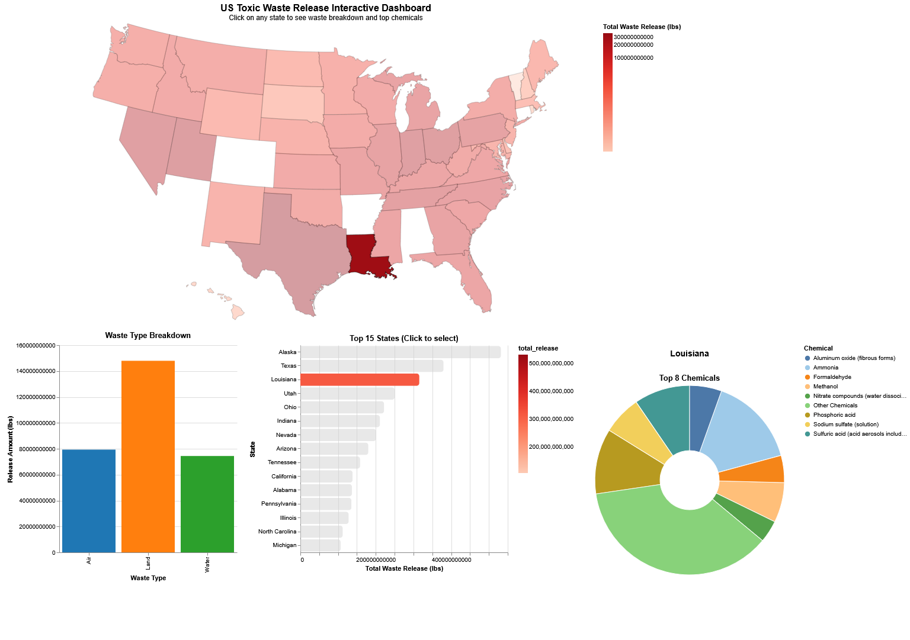
    
    4. Utah:
        Has Approximately 250 billion lbs of waste, containing majority of chemicals such as 76 billion of Copper and 72 billion of Lead and 39 billion lbs of Cholrine. Majority of waste is land based 190 billion lbs, but also has 48 billion lbs of Air waste.

        'from a team at Utah State University documents the ways metal-laden dust from the drying lakebed may find its way into human bodies — directly through ingestion and indirectly through food systems...Sediments produced by the dry playa around Great Salt Lake have been contaminated by a century of mining, waste disposal, oil refining and other human activities.'(Gilbert)

        https://www.usu.edu/today/story/new-research-toxins-from-great-salt-lake-dust-absorbed-by-plants-soils-human-bodies
    
    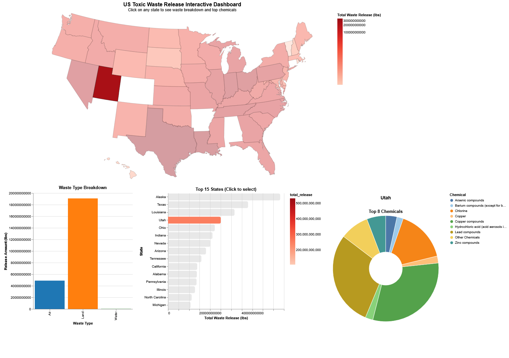
    
    5. Ohio
        Has Approximately 222 billion lbs of waste, containing majority of chemicals such as 22 billion of Hydrocholoric acid and 20 billion of Zinc and 19 billion lbs of Ammonia. Majority of waste is air based 86 billion lbs, but also has 72 billion lbs of land waste.

        'EPA estimates 20,000 gallons of hazardous waste is stored in various containers on the site, including chromium, lead, arsenic, various acids, and cyanide salts. Not all containers are labeled, and some containers are missing tops or lids. Improperly storing these materials could result in the release of hazardous substances into the environment.' (EPA) From Woodwill planting works

        https://www.epa.gov/newsreleases/epa-begins-removing-hazardous-waste-woodhill-plating-works-facility-cleveland-ohio
    
    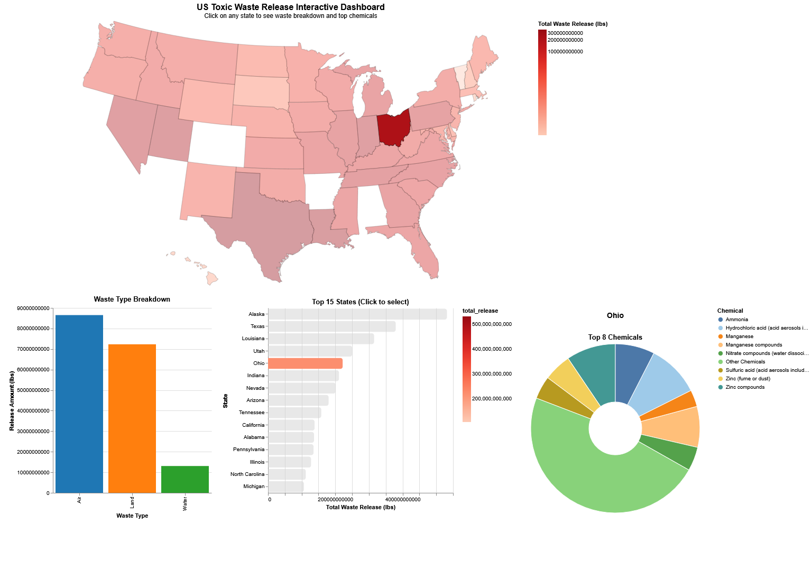

3. What County has the most pounds of waste throughout the years (Ranks 1 to Rank 5)?
    1. NorthWest Artic
        Has Approximately 478 billion lbs of waste, containing majority of chemicals such as 274 billion of Zinc and 190 billion lbs of lead. Majority of waste is land based 476 billion lbs. We determined that Red Dog Operations were the main culprit of dumping waste billions of waste in Alaska. 
    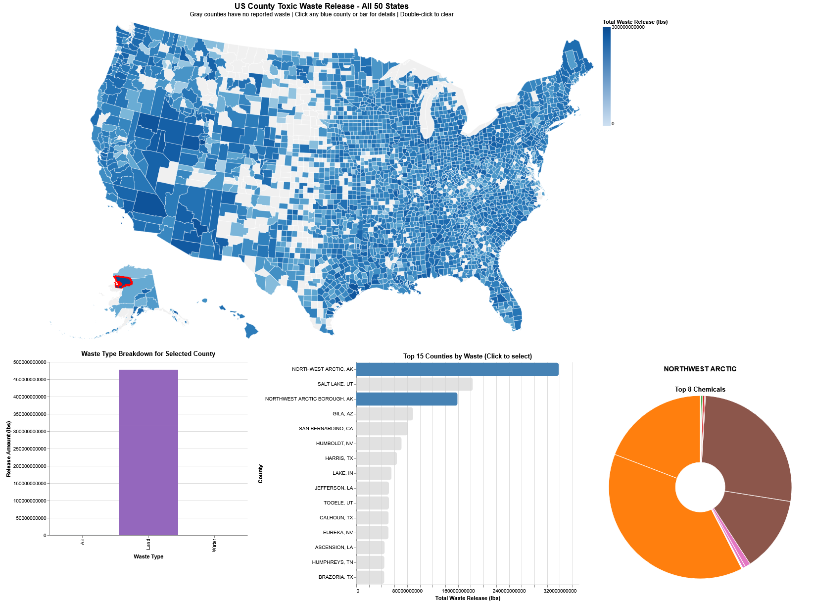

    2. Salt Lake, UT
        Has Approximately 183 billion lbs of waste, containing majority of chemicals such as 75 billion of Copper and 70 billion lbs of lead. Majority of waste is land based 175 billion lbs.
        According to my database most of the waste camefrom mining facilities such as Rio Tinto America
        and Kennecott Holdings Corp(Which is also owned by Rio Tinto)
        
        According to EPA "​​The Kennecott South Zone includes the Bingham Mining District in the Oquirrh Mountains. This is about 25 miles southwest of Salt Lake City, Utah...Mining activities at the site began in the 1860s and continue today. The waste from the mining contains hazardous substances, including heavy metals. Soils, sludge, surface water and groundwater are contaminated."
        https://cumulis.epa.gov/supercpad/SiteProfiles/index.cfm?fuseaction=second.cleanup&id=0800601
    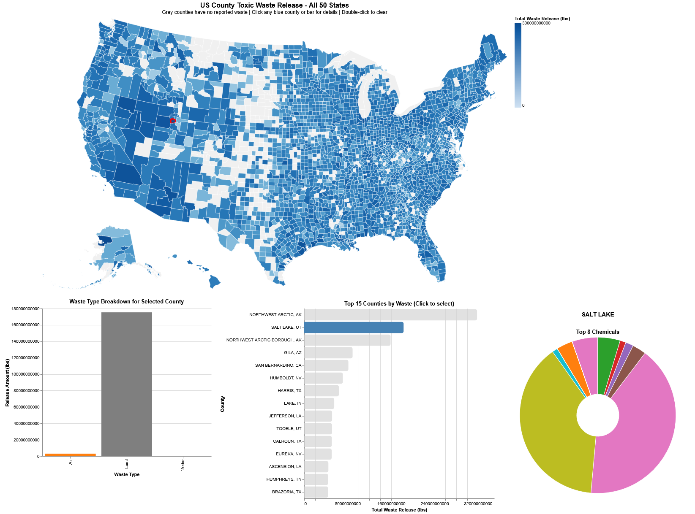

    3. Gila, AZ:
        Has Approximately 89 billion lbs of waste, containing majority of chemicals such as 38 billion of Zinc and 25 billion lbs of Zinc. Majority of waste is land based 87 billion lbs.
        According to my Database Most of the Waste came from Mining Facilities, such as Freeport-McMoRan Inc and Americas Mining Corp
    
    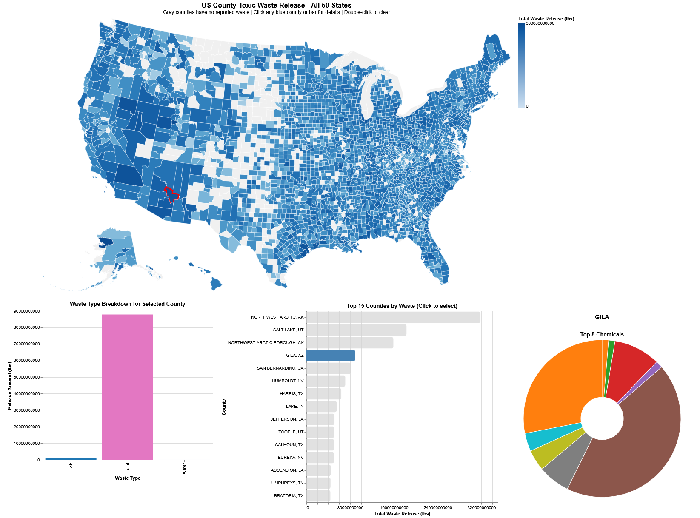

    4. San Bernerdino, CA:
        Has Approximately 81 billion lbs of waste, containing majority of chemicals such as 78 billion of Sodium Sulphate. Majority of waste is water based 55 billion lbs.
    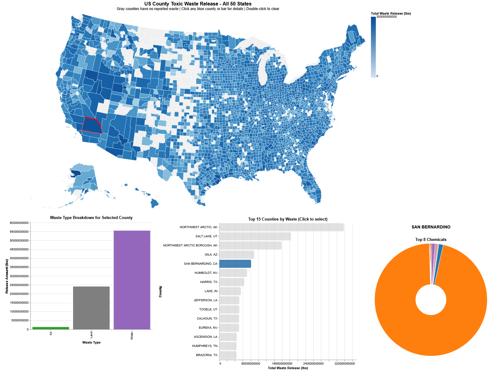

    5. Humboldt, NV:
        Has Approximately 71 billion lbs of waste, containing majority of chemicals such as 48 billion of Arsenic. Majority of waste is land based 71 billion lbs.
    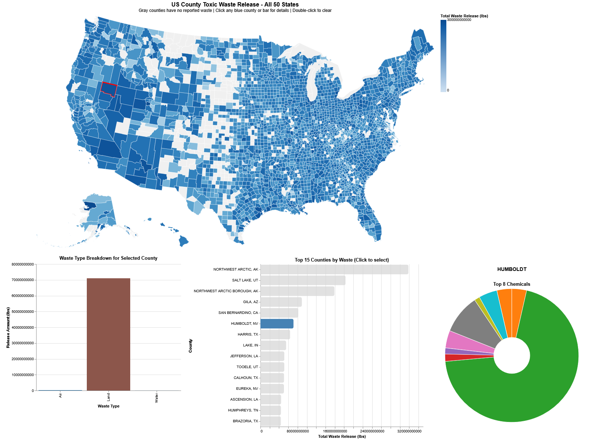

4. What industry was mostly in dumping the most waste? 
    1. Metal Ore Mining -> Copper, Zinc, Lead, and Nickle industry:

        Makes sense, according to our Total Waste by Facility Analysis, all top 5 facilites were from Metal Ore Mining subsector. What all of them had in common? They all mined Copper, Zinc, Lead, and Nickle.

    2. Chemical Manufacturing -> All Other Basic Organic Chemical Manufacturing:

        refers to the industrial sector (NAICS Code 325199) that produces basic organic chemicals, excluding petrochemicals, industrial gases, synthetic dyes, and cyclic crudes. 

        The American Cyanamid Superfund site is in Bridgewater Township, New Jersey. Prior owners used the 575-acre site for numerous chemical and pharmaceutical manufacturing operations for more than 90 years.

        As part of the operations, waste was placed in large pound-like structures called impoundments, and soil and groundwater became contaminated with various volatile organic compounds (VOCs), semi-volatile organic compounds (SVOCs), and metals.

        Volatile organic compounds (VOC) means any compound of carbon, excluding carbon monoxide, carbon dioxide, carbonic acid, metallic carbides or carbonates and ammonium carbonate, which participates in atmospheric photochemical reactions, except those designated by EPA as having negligible photochemical reactivity

    3. Primary Metal Manufacturing(Iron and Steel Mills and Ferroalloy Manufacturing):
        
        US Steel: USS is investigating the extent of contamination in the soil, sediment, groundwater, porewater and surface water resulting from historic spills and waste disposal.    

        Contaminants at Gary Works include metals, volatile and semi volatile organic compounds, and PCBs.

    4. Electrical Power Generation, Transmission, and Distribution (Fossil Fuel Eletric Power Generation):
        
        According to my database, Rio Tinto was mostly involved. 

    5. Paper Manufacturing(Pulp Mills):
        
        Decades of industrial activity at the former Rayonier Mill contaminated the water and sediments of the harbor and the soil around the mill. Rayonier A.M. Properties LLC is working under our oversight to study and clean up that contamination. We also work with Tribal representatives and many stakeholders to move cleanup forward in a way that considers the larger Port Angeles community.

        Rayonier has already removed over 30,000 tons of contaminated material from the site. This cleanup is a long, complex undertaking. We are committed to doing thorough work that upholds Washington’s laws and high standards to protect human health and the environment.
    
5. Total Waste Drop Top 10 facility vs Rest:
    Top 10 facility generated about 46.82 billion lbs of waste 27.11% of total waste and the rest 36003 facilities generated about 125.90 billion lbs of waste 72.89% of total waste. Total waste generated by known facilities is 172.72 billions lbs of waste.  

    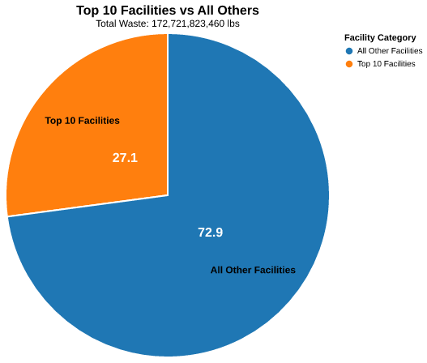

### Specific Questions:

1. Which chemicals is the most commonly released(Most Reported Chemicals Used)?
    Most used chemical were Lead -> Nitrate -> Hydrocholoric -> Ammonia -> Zinc
    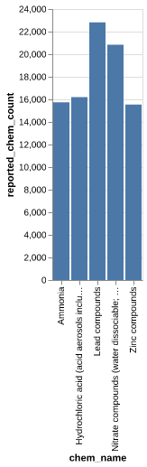
2. Which location has the most reported carcinogenic chemicals?
    TX HARRIS HOUSTON -> TX HARRIS PASADENA -> TX JEFFERSON PORT ARTHU -> KY JEFFERSON LOUISVILLE -> IL COOK CHICAGO
    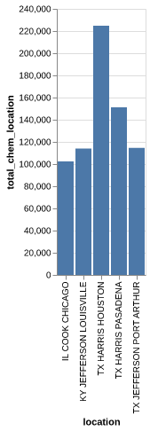
3. Air release vs water release vs land release, which domain dominates?
    By a Landslide, Land release has the most releases -> Air being the second -> Water being the least.
    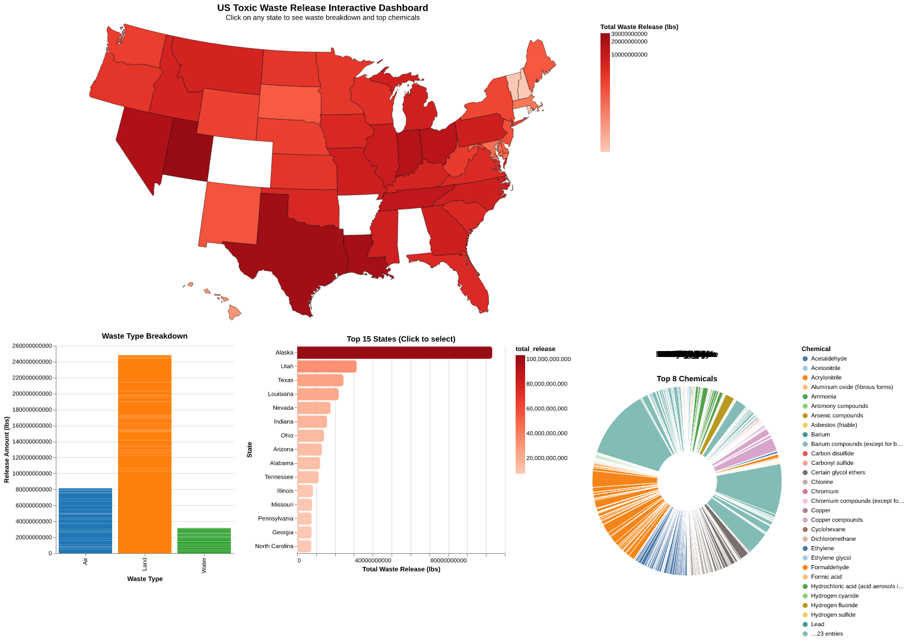

### Visualization:
1. Line chart depicting the trends of waste dumped by Top 10 facility(with the most toxic waste dumped) throughout the years.

    1. Top 30 Facility: 
        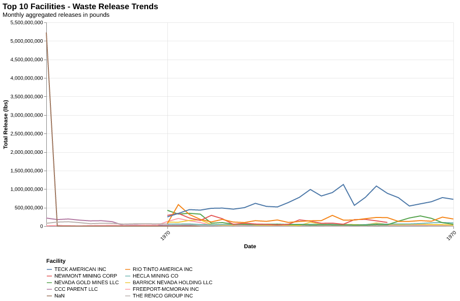[https://raghvandersinh.github.io/toxic-release-inventory-analysis/Frontend/chart/total_waste_throughout_top_10.html]

    * Click the HTML for Interactive Mode. 

2. Dashboard of the Total Waste Released in the US states and counties. 
        
    1. From(2003 - 2025) 
        * By County 2003-2025:
            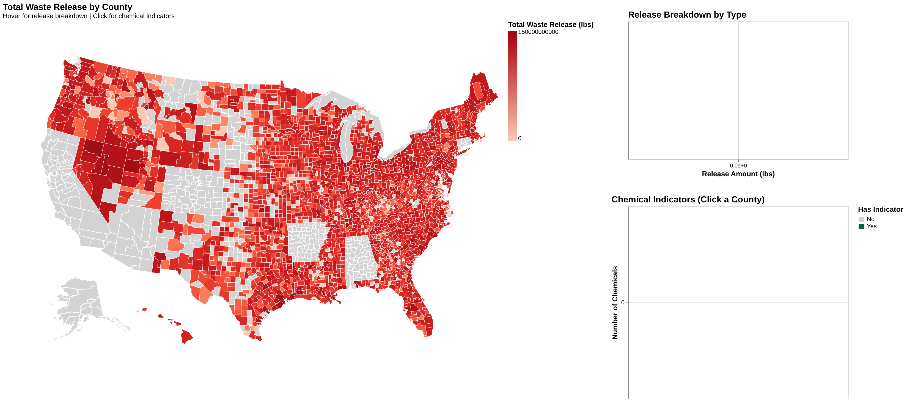[https://raghvandersinh.github.io/toxic-release-inventory-analysis/Frontend/chart/county_waste_dashboard_all_time.html]
            
        * By State 2003 - 2025: 
            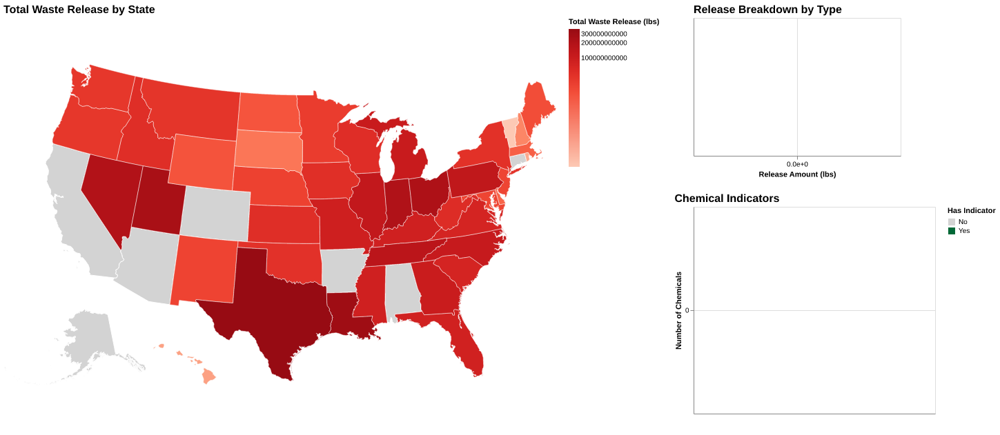[https://raghvandersinh.github.io/toxic-release-inventory-analysis/Frontend/chart/waste_dashboard_all_time.html]
        
    2. From(2020 - 2025) 
        * By County
            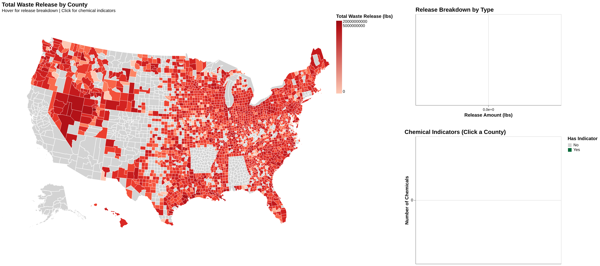[https://raghvandersinh.github.io/toxic-release-inventory-analysis/Frontend/chart/county_waste_dashboard_2020s.html]
            
        * By State:
            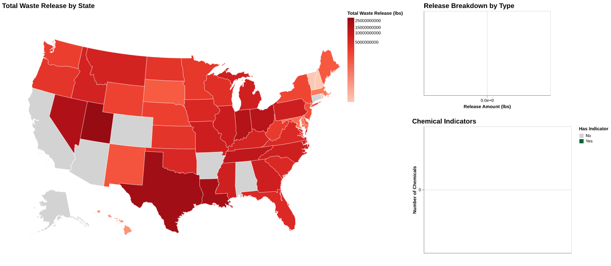[https://raghvandersinh.github.io/toxic-release-inventory-analysis/Frontend/chart/waste_dashboard_2020s.html]

            
    * Click the HTML for Interactive Mode. 

Process used:
* Used SQLAlchemy ORM(Object Relational Mapping) to generate Tables and Column for the TRI Database. 
* Used requests to connect to the TRI metadata API endpoints and extracted raw data from it 
* Used the raw data and transformed them into Pandas DataFrame with
necessary columns needed for the TRI Database.
* Cleaned up the data in the Pandas DataFrame to make it ready for DataBase insertion. 
* Then finally used the SQLAlchemy Postgresql Dialects to create an Upsert logic to avoid duplicate entries or errors during the insertion process. 
* Extra: Used Alembic autogeneration for automatic Database Migrations. 