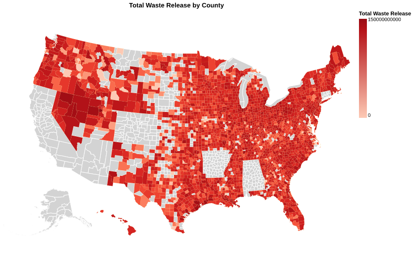
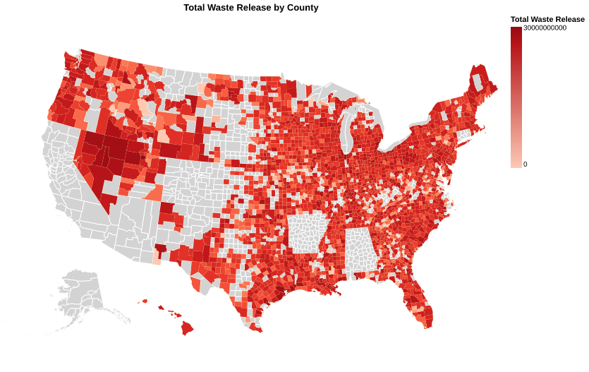

# Toxic Release Inventory(TRI) ELT/Analysis:

## A fully functional project written in Python that creates a TRI  Database Model and a Data Extraction Pipeline to insert clean data into the TRI database for further Analysis.

This goal of this project is answer questions such as:
* What are the Top 10 Facility Released The Most Toxic Waste Throughout the Years?
    [https://raghvandersinh.github.io/toxic-release-inventory-analysis/Frontend/chart/total_waste_throughout_top_10.html]

    Click the HTML for Interactive Mode. 
* What location has the most toxic relased?
    * From(2003 - 2025)
    [https://raghvandersinh.github.io/toxic-release-inventory-analysis/Frontend/chart/total_waste_by_counties.html]

    * From(2020 - 2025)
    [https://raghvandersinh.github.io/toxic-release-inventory-analysis/Frontend/chart/total_waste_by_counties_2020s.html]

    Click the HTML for Interactive Mode. 
* What state has the most dangerous toxic?
* To Be Continued...

Process used:
* Used SQLAlchemy ORM(Object Relational Mapping) to generate Tables and Column for the TRI Database. 
* Used requests to connect to the TRI metadata API endpoints and extracted raw data from it 
* Used the raw data and transformed them into Pandas DataFrame with
necessary columns needed for the TRI Database.
* Cleaned up the data in the Pandas DataFrame to make it ready for DataBase insertion. 
* Then finally used the SQLAlchemy Postgresql Dialects to create an Upsert logic to avoid duplicate entries or errors during the insertion process. 
* Extra: Used Alembic autogeneration for automatic Database Migrations. 